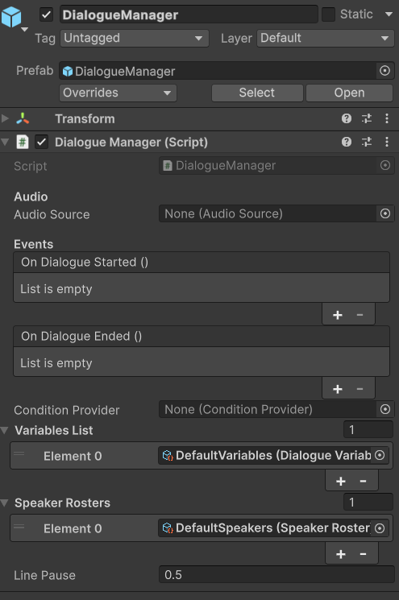

# API Reference

Complete reference for all public types, methods, properties, and events in Threader. For walkthroughs and examples, see the per-topic pages. This page is the definitive source for signatures and behaviour details.

---

## DialogueManager

`DialogueManager : MonoBehaviour`

Singleton. Add one to your scene. All interaction with the dialogue system goes through this class.

### Singleton access

```csharp
DialogueManager.Instance  // null when no manager exists in the scene
```

### Inspector fields

{ width="480" }

| Field | Type | Description |
|---|---|---|
| `audioSource` | `AudioSource` | 2D fallback audio source. Auto-created if not assigned. |
| `conditionProvider` | `ConditionProvider` | Optional. Assigned providers are forwarded to `ConditionService.SetProvider` in `Awake`. |
| `_variablesList` | `List<DialogueVariables>` | Assets searched in order for variable lookups. Exposed as `VariablesList`. |
| `_speakerRosters` | `List<SpeakerRoster>` | Assets that populate speaker dropdowns in the editor. Exposed as `SpeakerRosters`. |
| `_languageLibrary` | `LanguageLibrary` | Optional. Central language list. When assigned, graph Inspector language slots are driven by the library instead of free-text entry. Exposed as `LanguageLibrary`. |
| `linePause` | `float` | Seconds to wait after each NPC line before advancing. Default: 1. |
| `OnDialogueStarted` | `UnityEvent` | Inspector-wired event fired when dialogue starts. |
| `OnDialogueEnded` | `UnityEvent` | Inspector-wired event fired when dialogue ends. |

### Events (C# subscriptions)

Subscribe in `OnEnable`, unsubscribe in `OnDisable`.

```csharp
// Each dialogue line as it becomes current.
event Action<NPCLine> OnNPCLine;
```
- `NPCLine.SpeakerName` — resolved speaker name (graph default applied when the node's Speaker field is blank)
- `NPCLine.Text` — fully resolved text (variable tokens already substituted)

```csharp
// Every node event fired from any NPC node (local + global).
event Action<string> OnNodeEvent;
```
Guard with `CurrentActor` to scope handling to a specific NPC:
```csharp
manager.OnNodeEvent += key => {
    if (manager.CurrentActor != myNpc) return;
    HandleEvent(key);
};
```

```csharp
// Only events marked Global on the NPC node.
event Action<string> OnGlobalNodeEvent;
```
No actor guard needed — these are intentionally broadcast to all listeners.

```csharp
// A Player Choice node has become active.
// The list contains all choices, including those with IsHidden = true.
// Custom UIs must filter out IsHidden = true entries before rendering.
event Action<List<ChoiceData>> OnChoiceNode;
```
Each `ChoiceData` in the list:
- `Text` — resolved display text
- `IsLocked` — true if unfulfilled non-hiding conditions; show greyed out
- `IsHidden` — true if a hiding condition failed (choice is not shown to player)
- `ChoiceKey` — `"{nodeGuid}:{index}"` for history lookups

```csharp
// Dialogue has fully ended (after End node is processed).
event Action OnDialogueEnd;
```

```csharp
// Dialogue is starting. Also fires OnDialogueStarted (UnityEvent) in parallel.
event Action OnDialogueStartedEvent;
```

```csharp
// A bark line has become active (fired instead of OnNPCLine for bark graphs).
event Action<NPCLine> OnBark;
```
Wire this to a world-space speech bubble, HUD ticker, or any component that should display ambient NPC lines. Bark output never reaches `OnNPCLine` or the main dialogue panel.

### Properties

| Property | Type | Description |
|---|---|---|
| `Instance` | `DialogueManager` | Static singleton reference |
| `CurrentActor` | `IDialogueActor` | The actor currently running dialogue. `null` between conversations. |
| `IsDialogueActive` | `bool` | `true` while dialogue is running (blockables are blocked) |
| `CanCancel` | `bool` | `true` while dialogue is active **and** the current node does not have **Prevent Dialogue Exit** enabled |
| `ActiveLanguage` | `string` | The currently active language for line sheet resolution. Set via `SetActiveLanguage()`. |
| `ConditionProvider` | `ConditionProvider` | The provider assigned in the Inspector (read-only) |
| `VariablesList` | `IReadOnlyList<DialogueVariables>` | All assigned variable assets |
| `SpeakerRosters` | `IReadOnlyList<SpeakerRoster>` | All assigned roster assets |
| `LanguageLibrary` | `LanguageLibrary` | The Language Library assigned in the Inspector. `null` if not set. |

### Methods

```csharp
void StartDialogue(DialogueGraph graph, string entryPointKey = null, IDialogueActor actor = null)
```
Starts a dialogue. Resolves the entry point, fires `OnDialogueStarted`, blocks all registered blockables, then starts the runner. If any registered `IDialogue` also implements `IDialogueReady`, the runner waits until `IsDialogueReady` is `true` on all of them.

- `graph` — must not be null
- `entryPointKey` — empty/null = default start node
- `actor` — passed to the runner so End nodes can call `actor.SetEntryPoint()`

---

```csharp
void SelectChoice(int index)
```
Tells the runner which choice the player made. Call from your choice button callbacks. `index` is the 0-based position in the list passed to `OnChoiceNode`. Calling with an out-of-range index logs an error and is ignored.

---

```csharp
void CancelDialogue()
```
Immediately ends active dialogue — stops all coroutines and audio, then fires `OnDialogueEnd` and `OnDialogueEnded`. No-op if no dialogue is running or if the current node has **Prevent Dialogue Exit** enabled. Safe to call from any UI button or key handler.

---

```csharp
void PlayBark(DialogueGraph graph, Transform actorTransform = null, string speakerName = null)
```
Runs a bark graph on a second non-blocking runner. The main conversation runner is completely unaffected — barks never block the player or fire `OnDialogueStarted`. Each line fires `OnBark` instead of `OnNPCLine`.

- `graph` — must have `IsBark` set to `true`; passing a normal dialogue graph logs a warning
- `actorTransform` — optional; used for 3D audio positioning. May be `null` for 2D audio.
- `speakerName` — optional; the third-level fallback in the bark speaker resolution chain (node speaker → graph default → this name). `BarkSource` passes its **Speaker Name** field automatically. Use this when calling `PlayBark()` from code to ensure correct line sheet lookup.

---

```csharp
void RegisterBlockable(IDialogue blockable)
void UnregisterBlockable(IDialogue blockable)
```
Register/unregister a component to receive `Block()` and `Unblock()` calls when dialogue starts and ends. Also used for `IDialogueFocus` (camera) and `IDialogueReady` (transition gate). Call `Register` in `OnEnable` and `Unregister` in `OnDisable`.

---

```csharp
void RegisterSpeaker(string name, Transform t)
void UnregisterSpeaker(string name)
```
Register a named speaker. The name must match the **Speaker Name** field on NPC nodes in the graph. Used to:
- Position spatial audio at the speaker's world location
- Direct `IDialogueFocus` to look at the correct NPC mid-dialogue

`NPCDialogue` calls `RegisterSpeaker` in `Start` automatically. For `DialogueTrigger`, you do not need to register manually (it uses the trigger's own transform as a fallback). Register manually only for NPCs added dynamically at runtime.

---

```csharp
void SetBlocked(bool value)
```
Manually block or unblock all registered blockables. Call if you need to freeze the player for reasons other than dialogue (e.g. a cutscene that runs alongside dialogue). Normally called internally.

---

```csharp
void SetActiveLanguage(string language)
```
Sets the active language for line sheet resolution. When a language is set, `DialogueManager` calls `graph.GetSheet(activeLanguage)` to retrieve the language-specific sheet for each graph. The sheet's `PreviewText` fields provide localised NPC line text, and the sheet's audio clips provide language-specific VO.

Call once from your language/settings menu — the setting persists for the lifetime of the `DialogueManager` instance.

```csharp
DialogueManager.Instance.SetActiveLanguage("French");
```

---

### Audio behaviour

- When a line has an `AudioClip` and the speaker's `Transform` is in the registry, the clip plays from a hidden spatial `AudioSource` repositioned to the speaker's world position (`spatialBlend = 1`, `rolloffMode = Linear`). The runner waits with `WaitWhile(() => _spatialSource.isPlaying && !DialogueUI.SkipLineRequested)`.
- If no speaker transform is known, the clip plays from the 2D `audioSource` component. The runner waits with `WaitWhile(() => audioSource.isPlaying && !DialogueUI.SkipLineRequested)`.
- In both cases, if a skip is requested mid-clip, the source is stopped immediately. `linePause` is applied **after** the clip ends (also skippable).
- When no clip exists, the runner waits for `DialogueUI.IsTyping` to become false, then waits `linePause` seconds before advancing.

---

## IDialogueActor

```csharp
public interface IDialogueActor
{
    DialogueGraph Graph               { get; }
    string        ActiveEntryPointKey { get; }
    string        SpeakerName         { get; }

    void SetEntryPoint(string key);
    void ResetEntryPoint();
    void StartDialogue();
}
```

Implemented by `NPCDialogue` and `DialogueTrigger`. Implement on your own components if you have a custom interaction system. Gives quest scripts, cutscene scripts, and save systems a stable interface that doesn't depend on which NPC component is used.

| Member | Description |
|---|---|
| `Graph` | The `DialogueGraph` this actor runs. |
| `ActiveEntryPointKey` | Current entry point override. Null/empty = start node. |
| `SpeakerName` | The speaker name for this actor. Used as the third-level fallback in sub-graph speaker resolution. |
| `SetEntryPoint(key)` | Switches the active branch for the next `StartDialogue` call. |
| `ResetEntryPoint()` | Clears the override (sets to null). |
| `StartDialogue()` | Starts dialogue from `ActiveEntryPointKey`. |

See [Entry Points](entry-points.md) for patterns and save/restore detail.

---

## IDialogue

```csharp
public interface IDialogue
{
    void Block();
    void Unblock();
}
```

Implement on any component that should pause when dialogue is active — player movement, hotkeys, game menus, etc. Register with `DialogueManager.RegisterBlockable`.

---

## IDialogueFocus

```csharp
public interface IDialogueFocus
{
    void FocusOn(Transform target);
    void ReleaseFocus();
}
```

Implement alongside `IDialogue` on your player camera controller. When **Look At Speaker** is enabled in the Graph Editor sidebar and a speaker transform is registered, `FocusOn` is called each time a new NPC node is reached. `ReleaseFocus` is called when dialogue ends.

---

## IDialogueReady

```csharp
public interface IDialogueReady
{
    bool IsDialogueReady { get; }
}
```

Implement alongside `IDialogue` when your blockable needs a moment to complete a transition (a camera cut, a fade-in) before the first line is displayed. `DialogueManager.StartDialogue` waits on `WaitUntil(() => IsDialogueReady)` for every registered blockable that also implements this interface before starting the runner.

---

## NPCDialogue

`NPCDialogue : MonoBehaviour, IDialogueActor`

Drop on an NPC GameObject for code-driven interaction (the dialogue is started by your own input system rather than a trigger collider).

### Inspector fields

| Field | Type | Description |
|---|---|---|
| `graph` | `DialogueGraph` | The graph this NPC runs. |
| `speakerName` | `string` | Must match the Speaker Name set on NPC nodes. Registers this transform with `DialogueManager.RegisterSpeaker`. |
| `IsInteractable` | `bool` | Public flag for your input system to check before calling `StartDialogue`. Not enforced internally. |
| `NodeEvents` | `List<NodeEventResponse>` | Per-key `UnityEvent` responses for node events fired during this NPC's dialogue. |

### Methods

| Method | Description |
|---|---|
| `StartDialogue()` | Calls `DialogueManager.Instance.StartDialogue(graph, _activeEntryPointKey, this)`. |
| `SetEntryPoint(string key)` | Stores key for next `StartDialogue`. |
| `ResetEntryPoint()` | Clears the stored key. |

`NPCDialogue` subscribes to `DialogueManager.OnNodeEvent` in `Start()`. When an event fires with a key matching an entry in `NodeEvents`, the corresponding `UnityEvent` is invoked. This allows per-NPC event responses without any custom C#.

---

## DialogueTrigger

`DialogueTrigger : MonoBehaviour, IDialogueActor`

Drop on an NPC with a trigger Collider. Handles collision detection and player input natively.

### Inspector fields

| Field | Type | Description |
|---|---|---|
| `graph` | `DialogueGraph` | The graph to run. |
| `playerTag` | `string` | Tag that identifies the player. Default: `"Player"` |
| `interactKey` | `KeyCode` | Key to press when in range. Default: `E`. Ignored if `startOnEnter` is true. |
| `startOnEnter` | `bool` | Start dialogue immediately when player enters trigger zone. |
| `interactPrompt` | `GameObject` | Optional UI prompt shown when player is in range (e.g. "Press E"). |
| `activeEntryPointKey` | `string` | Serialized in the scene. Edit at design time to start partway through a graph. |

### Validation

On `Start()`, `ValidateSetup()` runs:
- Warns if no trigger `Collider` or `Collider2D` found on this or children
- Warns if no `Rigidbody` or `Rigidbody2D` found (required for `OnTriggerEnter`)
- Warns if no `DialogueGraph` assigned

### Methods

```csharp
void TriggerDialogue()
```
Safe to call from a `UnityEvent`, animation event, or external script. Guards against null manager/graph and logs errors if either is missing.

---

## DialogueGraph

`DialogueGraph : ScriptableObject`

Create via **Assets → Create → Threader → Dialogue Graph**.

### Inspector fields

| Field | Type | Description |
|---|---|---|
| `Nodes` | `List<DialogueNode>` | All nodes in the graph (SerializeReference) |
| `StartNodeGuid` | `string` | GUID of the default start node |
| `DefaultSpeakerName` | `string` | Fallback speaker name for NPC nodes with no speaker override |
| `LookAtSpeaker` | `bool` | When true, calls `IDialogueFocus.FocusOn` on the speaking NPC's transform. Set via the **Look At Speaker** toggle in the Graph Editor sidebar. Hidden in the editor when `IsBark` is true. |
| `IsBark` | `bool` | When true, this graph is treated as a bark graph. Set via the **Graph Type** dropdown in the GRAPH sidebar. `PlayBark()` requires this to be true. |
| `EntryPoints` | `List<DialogueEntryPoint>` | Named entry points. Set via right-click in the editor. |
| `Groups` | `List<DialogueGroupData>` | Comment boxes (editor-only) |
| `StickyNotes` | `List<StickyNoteData>` | Sticky notes (editor-only) |
| `LineSheets` | `List<NamedLineSheet>` | Per-language line sheet assignments. Each entry pairs a language string with a `DialogueLineSheet` asset. See [Line Sheet — Multi-language support](line-sheet.md#multi-language-support). |

### Methods

```csharp
string ResolveEntryPointGuid(string key)
```
Returns the node GUID for `key`. Falls back to `StartNodeGuid` if `key` is null, empty, or not found. Logs a warning (not an error) on fallback when a non-empty key was supplied. Called by `DialogueManager.StartDialogue`.

---

```csharp
DialogueLineSheet GetSheet(string language)
```
Resolves the line sheet for the given language. If `LineSheets` is empty, falls back to the legacy single `LineSheet` field. If `language` is non-empty and a matching entry exists, returns that sheet. If no match is found or `language` is null/empty, returns the **first sheet** in the list (the default language). Returns `null` only when no sheets are configured at all. Called internally by `DialogueManager` when resolving audio clips and localized text for each NPC line. See [Translation — GetSheet fallback chain](translation.md#getsheet-fallback-chain).

---

## NamedLineSheet

```csharp
[Serializable]
public class NamedLineSheet
{
    public string Language;
    public DialogueLineSheet Sheet;
}
```

Pairs a language identifier with a `DialogueLineSheet` asset. Stored in `DialogueGraph.LineSheets`. The `Language` string is matched against `DialogueManager.ActiveLanguage` at runtime.

---

## LanguageLibrary

`LanguageLibrary : ScriptableObject`

Create via **Assets → Create → Threader → Language Library**.

| Field | Type | Description |
|---|---|---|
| `Languages` | `List<string>` | Ordered list of language names. The first entry is the default/primary language. |

Assign to `DialogueManager` to drive language slots on all graph Inspectors. When a library is present, the Graph Editor shows one read-only row per library language instead of free-text entry. See [Translation — Language Library](translation.md#language-library).

---

## BarkSource

`BarkSource : MonoBehaviour`

Add to any NPC GameObject (alongside `NPCDialogue`) to automate bark playback without any C#. Calls `DialogueManager.PlayBark()` based on the configured trigger mode.

### Inspector fields

| Field | Type | Description |
|---|---|---|
| `barkGraph` | `DialogueGraph` | The bark graph to play. Must have `IsBark = true`. |
| `triggerMode` | `TriggerMode` | `OnEnter` — fires when the player enters the trigger collider. `OnTimer` — fires on an interval. `Manual` — call `Bark()` from script. |
| `playerTag` | `string` | Tag used to identify the player for `OnEnter` trigger mode. Default: `"Player"`. |
| `cooldown` | `float` | Minimum seconds between barks. Default: `8`. Prevents rapid repeat firing regardless of trigger mode. |
| `speakerName` | `string` | The speaker name this NPC is registered under. Must match their `NPCDialogue` Speaker Name. Used for line sheet audio clip and animator action lookup. |
| `suppressDuringDialogue` | `bool` | When true (default), barks are silently skipped while a full conversation is active. |

### Methods

```csharp
void Bark()
```
Manually triggers the bark. Safe to call from a `UnityEvent`, animation event, or external script. Respects cooldown and the `suppressDuringDialogue` setting.

---

## DialogueVariables

`DialogueVariables : ScriptableObject`

Create via **Assets → Create → Threader → Variables Store**.

### Inspector fields

| Field | Type | Description |
|---|---|---|
| `Variables` | `List<DialogueVariable>` | Design-time defaults. Each entry has `Name`, `Type`, `DisplayName`, and a value field. |

### Methods

```csharp
void InitRuntime()
```
Copies design-time defaults into runtime dictionaries. Call explicitly to reset all variables (new game). Called automatically on first access if not called manually.

---

```csharp
bool   GetBool(string name)
int    GetInt(string name)
string GetString(string name)
```
Returns the current runtime value. Default: `false`, `0`, `""` if the name is not found. Calls `EnsureInit()` automatically.

---

```csharp
void SetBool(string name, bool value)
void SetInt(string name, int value)
void SetString(string name, string value)
```
Writes to the runtime dictionary. Logs a warning if the name doesn't exist in the design-time list or if the type doesn't match. Calls `EnsureInit()` automatically.

---

```csharp
string GetDisplayName(string name)
```
Returns `DialogueVariable.DisplayName` if non-empty, otherwise returns `name`. Used by `{varName:name}` text substitution tokens.

---

```csharp
VariableType? GetVariableType(string name)
```
Returns the type enum, or `null` if the name is not in the design-time list.

---

```csharp
string GetValueAsString(string name)
```
Returns the current runtime value as a string, or `"(not found)"` if the name doesn't exist.

---

### Runtime lifecycle

- Runtime dictionaries are private, non-serialized. Play-mode changes never write back to the `.asset` file.
- When the asset is unloaded (`OnDisable`), `_initialised` is reset to `false` — the next access calls `InitRuntime` again from defaults.
- Multiple `DialogueVariables` assets can be assigned to `DialogueManager.VariablesList`. Variable name lookups search assets in list order. If two assets have the same name, only the first is found.

---

## SpeakerRoster

`SpeakerRoster : ScriptableObject`

Create via **Assets → Create → Threader → Speaker Roster**.

| Member | Description |
|---|---|
| `Speakers` | `List<string>` — all canonical speaker names |
| `bool Contains(string name)` | Returns true if the name is in the list (case-sensitive) |

Assign one or more rosters to `DialogueManager`. Speaker fields in the graph editor become type-safe dropdowns populated from all assigned rosters combined.

---

## ConditionService (static)

```csharp
public static class ConditionService
```

Routes condition evaluation from the graph runner to your game code.

### Property

```csharp
static ConditionProvider Provider { get; }
```
Returns the active provider. If none was explicitly set, attempts `Resources.Load<ConditionProvider>("DialogueSystem/DefaultConditionProvider")`.

### Methods

```csharp
static void SetProvider(ConditionProvider provider)
```
Explicitly assign a provider. Called by `DialogueManager.Awake` if one is assigned in the Inspector. Pass `null` to clear and allow Resources lookup.

---

```csharp
static void Register(string conditionKey, Func<string, bool> evaluator)
static void Unregister(string conditionKey)
static void ClearDelegates()
```
Register/unregister inline delegates by key. The delegate receives the parameter string from the choice's **Condition Parameter** field.

- `Register` overwrites any existing delegate for the same key (no duplicate protection beyond last-write-wins)
- `Unregister` silently succeeds if the key is not registered
- `ClearDelegates` removes all entries — useful in `OnDestroy` of a manager object that owns many registrations

---

```csharp
static bool Evaluate(ConditionDefinition definition, string parameter)
```
Resolution order:
1. `VariableConditionDefinition` — self-evaluates against the `Variables` asset assigned directly on the definition asset (no delegate or provider needed)
2. Registered delegate for `definition.GetKey()` — if found, the delegate is invoked with `parameter` and its result returned
3. Active `ConditionProvider` asset — `provider.Evaluate(definition, parameter)` is called if no delegate is registered
4. `WhenMissing` fallback — `Allow` returns `true` silently; `Block` returns `false` and logs a warning

Returns `true` if `definition` is `null`.

---

## NPCLine

Data struct passed to `OnNPCLine` each time a dialogue line becomes active.

| Property | Type | Description |
|---|---|---|
| `SpeakerName` | `string` | Resolved speaker name. Graph `DefaultSpeakerName` is applied when the node's own Speaker field is blank. |
| `Text` | `string` | Fully resolved line text. Variable tokens (`{varName}`, `{varName:name}`) are already substituted. |

---

## ChoiceData

Data object passed per-item in the `List<ChoiceData>` delivered to `OnChoiceNode`.

| Property | Type | Description |
|---|---|---|
| `Text` | `string` | Resolved display text for the choice button. Variable tokens already substituted. |
| `IsLocked` | `bool` | `true` when a non-hiding condition failed. The choice is shown but should be rendered as unavailable (greyed out). |
| `IsHidden` | `bool` | `true` when a hiding condition failed. The choice should not be rendered at all. Filter these before creating buttons. |
| `ChoiceKey` | `string` | Stable identifier in the format `"{nodeGuid}:{index}"`. Used as the key for choice history tracking. |

---

## ConditionProvider (abstract)

```csharp
public abstract class ConditionProvider : ScriptableObject
{
    public abstract bool Evaluate(ConditionDefinition definition, string parameter);
}
```

Subclass this to centralize condition evaluation in a single `ScriptableObject`. Assign the instance to `DialogueManager.ConditionProvider` or call `ConditionService.SetProvider`. Inside `Evaluate`, use `definition.GetKey()` and `parameter` to implement your routing logic.

---

## ConditionDefinition

`ConditionDefinition : ScriptableObject`

Create via **Assets → Create → Threader → Condition (Custom)**.

| Field | Description |
|---|---|
| `Key` | Lookup key. If empty, `name` (asset file name) is used. |
| `DisplayName` | Human-readable label in the editor. Falls back to `name`. |
| `Category` | Groups conditions in pickers as `Category/Name`. |
| `ParameterHint` | Tooltip on the parameter field in the graph. |
| `WhenMissing` | `Allow` (pass) or `Block` (fail) when no handler is registered. |

### Methods

```csharp
string GetKey()         // Key ?? name
string GetDisplayName() // DisplayName ?? name
```

---

## ConditionStore (static)

Optional in-memory key/value store for condition state. Pairs with `ConditionStoreProvider`.

```csharp
static void Set(string key, string value)
static bool TryGet(string key, out string value)  // false if key missing
static void SetInt(string key, int value)
static int  GetInt(string key, int fallback = 0)  // fallback if key missing or not a number
static void Remove(string key)
static void Clear()
```

No persistence — resets each time you enter Play mode. Repopulate from your game-state objects after loading a save.

---

## DialogueChoiceHistory (static)

Tracks which choices the player has selected. Stored as a `HashSet<string>`.

```csharp
static void   MarkVisited(string choiceKey)                    // called by runner automatically
static bool   IsVisited(string choiceKey)                      // query from quest/UI code
static void   Clear()                                          // call on new game
static string[] GetSaveData()                                  // snapshot for save system
static void   LoadSaveData(IEnumerable<string> keys)           // restore — merges, not replaces
```

Key format: `"{choiceNodeGuid}:{choiceIndex}"`. Stable unless the node is deleted/recreated or choices are reordered.

`LoadSaveData` **merges** with existing data. Call `Clear()` first if you want a clean slate before loading.

---

## NPCLine (data class)

```csharp
public class NPCLine
{
    public string Text;        // resolved display text (tokens substituted)
    public string SpeakerName; // resolved speaker name (graph default applied)
}
```

Passed to `OnNPCLine` subscribers.

---

## ChoiceData (data class)

```csharp
public class ChoiceData
{
    public string               Text;                // resolved display text
    public string               NextNodeGuid;        // internal routing — read-only
    public List<VariableCondition> Conditions;       // inline conditions
    public ConditionDefinition  ConditionDefinition; // custom condition asset
    public string               ConditionParameter;  // parameter string
    public bool                 NegateCondition;     // invert custom condition result
    public bool                 IsLocked;            // true = show greyed out
    public bool                 IsHidden;            // true = don't show
    public string               ChoiceKey;           // "{nodeGuid}:{index}"
}
```

When variable substitution is needed (`DialogueManager.VariablesList` is non-empty), a fresh list of display copies is created and passed to `OnChoiceNode` so the originals on the graph asset are never mutated. If no variables are assigned, the original list is passed directly — `IsLocked`, `IsHidden`, and `ChoiceKey` are `[NonSerialized]` runtime-only fields so they are never written back to disk regardless.

---

## Variable substitution in text

`DialogueManager.ResolveText(string text)` and the equivalent in `DialoguePreviewWindow` handle `{token}` substitution.

| Token | Result |
|---|---|
| `{varName}` | Current runtime value of the variable named `varName`. Bool renders as `"true"` or `"false"` (lowercase). |
| `{varName:name}` | Display name of the variable (from `DialogueVariable.DisplayName`, falls back to `varName`). |
| `{unknownVar}` | Left as-is — visible in the game as an authoring hint |

Regex used: `\{([^}:]+)(?::([^}]*))?\}` (compiled, cached as a static field).

Applied to: NPC line text, choice text (as display copies — originals are never mutated).

---

## DialogueEntryPoint

```csharp
[Serializable]
public class DialogueEntryPoint
{
    public string Key;      // key used in SetEntryPoint / StartDialogue
    public string NodeGuid; // target node
}
```

Stored on `DialogueGraph.EntryPoints`. Set via right-click → **Set as Entry Point** in the graph editor.

---

## SwitchNode (data classes)

```csharp
public class SwitchNode : DialogueNode
{
    public List<SwitchCase> Cases;
    public string DefaultNodeGuid;
}
```

```csharp
[Serializable]
public class SwitchCase
{
    public string Label;
    public List<VariableCondition> Conditions;
    public string NextNodeGuid;
}
```

Each `SwitchCase` holds a label, a list of variable conditions (AND logic), and an output GUID. Cases are evaluated top-to-bottom; the first match wins. `DefaultNodeGuid` is followed when no case matches.

---

## WeightedRandomNode (data classes)

```csharp
public class WeightedRandomNode : DialogueNode
{
    public List<WeightedOutput> Outputs;
}
```

```csharp
[Serializable]
public class WeightedOutput
{
    public float Weight;
    public string NextNodeGuid;
}
```

Each output has a `Weight` (float). At runtime, one output is selected randomly with probability proportional to its weight relative to the total.

---

## ChoiceSheetRow

```csharp
[Serializable]
public class ChoiceSheetRow
{
    public string NodeGuid;
    public int    ChoiceIndex;
    public string PreviewText;
}
```

Stored in `DialogueLineSheet.ChoiceRows`. Holds localized choice text for a specific choice on a Player Choice node. Looked up via `sheet.LookupChoiceRow(nodeGuid, choiceIndex)`.

---

## Enums

```csharp
public enum VariableType   { Bool, Int, String }
public enum SetOperator    { Set, Add, Subtract, Toggle }
public enum WhenMissingBehaviour { Allow, Block }
public enum AnimatorParamType    { Trigger, Bool, Int, Float }
public enum CompareOperator
{
    Equal, NotEqual,
    GreaterThan, GreaterOrEqual,
    LessThan, LessOrEqual
}
// Note: Bool and String support only Equal / NotEqual. GreaterThan/etc. are effective on Int only.
public enum DebugLogType { Log, Warning, Error }
public enum NodeType
{
    NPC, PlayerChoice, End,
    Branch, SetVariable, Random, Jump,
    Debug, Wait, FireEvent, PlayAudio, AnimatorTrigger,
    SubGraph, Switch, WeightedRandom
}
```
