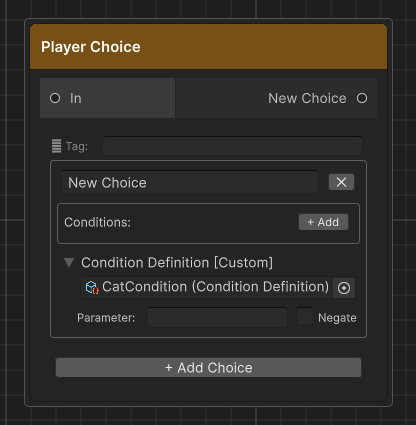

# Conditions

Conditions control whether a player choice is **available** at runtime. Threader has two distinct systems — you can use either or both on the same choice.

| System | Requires C#? | Best for |
|---|---|---|
| Inline variable conditions | No | Checking `DialogueVariables` values set from the graph |
| Custom conditions (C#) | Yes | Anything that lives in your game code — inventory, quests, reputation, time of day |

When both are used on the same choice, **all** must pass for the choice to be selectable.

---

## What happens when a condition fails

Each inline condition row has a **Hide** checkbox that controls the UI presentation:

| Hide checked | The choice is completely removed from the list (`IsHidden = true`) |
|---|---|
| Hide unchecked | The choice is shown greyedout and locked (`IsLocked = true`, unclickable) |

The custom ConditionDefinition slot has a **Negate** toggle and the definition asset has a **When Missing** setting (see below), but no per-definition Hide — if it fails, the choice is locked but not hidden. If you need hiding behaviour from a custom condition, use the **Negate** toggle combined with a variable that your C# code writes.

---

## Inline variable conditions (no C# required)

These are added directly inside each choice card in the Player Choice node editor.

### Setup in 3 steps

**Step 1 — Create a DialogueVariables asset** (if you haven't already):

Right-click in the Project window → **Create → Threader → Variables Store**.  
Add variables in the Inspector. See [Variables](variables.md) for full detail.

**Step 2 — Assign the asset to DialogueManager:**

Drag the asset into **DialogueManager → Variables List**.

**Step 3 — Add conditions in the graph:**

Open a Player Choice node. Inside each choice card, click **+ Add** in the Conditions box.

| Field | Description |
|---|---|
| Variable | Dropdown of all variable names from assigned assets |
| Operator | Equal / NotEqual / GreaterThan / GreaterOrEqual / LessThan / LessOrEqual |
| Value | The comparison value — `true`/`false`, a number, or a string |
| Hide | Hides the choice entirely when this row fails |
| NOT | Inverts this row's result before it contributes |
| ✕ | Removes this row |

### AND logic

All rows on a choice must pass for the choice to be selectable. There is no built-in OR. To achieve OR logic, duplicate the choice and put a different condition on each copy — they lead to the same branch.

### Variable names are case-sensitive

`foundCat` ≠ `FoundCat`. If you type a name that doesn't exist in any assigned asset, the row is silently skipped and the choice always appears — double-check spelling if a condition has no effect.

### Example

```
Choice:  "Offer the fish"

Conditions:
  hasFish   Equal   true       Hide = ✓
  gold      GreaterOrEqual  10  Hide = ✗
```

Result: the choice is hidden until `hasFish` is true. Once `hasFish` is true, if `gold < 10` the choice shows but is greyed out.

---

## Branch Node conditions

The **Branch Node `[B]`** uses the same condition system (Variable / Operator / Value / NOT), but instead of locking/hiding a choice it routes execution to a True or False output port. All rows are AND logic — True port if all pass, False port if any fail.

See [Node Reference — Branch Node](nodes.md#branch-node-b) for full field details.

---

## Custom conditions (C# required)

Use this when the state you need to check lives in your game code — an inventory system, a quest log, a reputation tracker, etc.

The workflow has two parts:
1. **Register a handler** in C# that evaluates the condition
2. **Link a ConditionDefinition asset** to a choice in the graph

### Step 1 — Register a handler

#### Option A: Delegate (simplest)

Call `ConditionService.Register` from `Awake` on any `MonoBehaviour`. The lambda closes over whatever your game code exposes.

```csharp
public class PlayerWallet : MonoBehaviour
{
    public int Gold = 100;

    void Awake()
    {
        ConditionService.Register("GoldGTE", param =>
        {
            int.TryParse(param, out int needed);
            return Gold >= needed;
        });
    }

    void OnDestroy() => ConditionService.Unregister("GoldGTE");
}
```

The delegate is stored in a static dictionary keyed by the condition key string. Multiple delegates can be registered from multiple MonoBehaviours — each has its own key.

> Always `Unregister` in `OnDestroy` (or `OnDisable` if your object might be disabled). Failing to unregister means the delegate persists even after the object is destroyed — the next scene load might fail with a null reference if the lambda captures a destroyed object.

#### Option B: ConditionProvider subclass (all conditions in one asset)

Create a `ScriptableObject` that inherits `ConditionProvider` and override `Evaluate`. Good when you have many conditions and want them in one organized, inspectable place.

```csharp
[CreateAssetMenu(menuName = "Threader/My Condition Provider")]
public class GameConditionProvider : ConditionProvider
{
    public override bool Evaluate(ConditionDefinition def, string param)
    {
        switch (def.GetKey())
        {
            case "GoldGTE":
                return int.TryParse(param, out int n) && Economy.Instance.Gold >= n;

            case "HasItem":
                return Inventory.Instance.Has(param);

            case "QuestComplete":
                return QuestManager.Instance.IsComplete(param);

            default:
                // Fall back to the definition's WhenMissing setting
                return def.WhenMissing == WhenMissingBehaviour.Allow;
        }
    }
}
```

Create an instance of this asset and assign it to **DialogueManager → Condition Provider** in the Inspector, or call `ConditionService.SetProvider(myProvider)` from a bootstrap script.

### Evaluation order

When a choice has a `ConditionDefinition`, `ConditionService.Evaluate` resolves in this priority order:

1. **VariableConditionDefinition** — if the asset is a `VariableConditionDefinition`, it self-evaluates directly (no delegate or provider needed)
2. **Registered delegate** — if a delegate is registered for this key, it runs
3. **Active ConditionProvider** — if a provider is assigned and no delegate matched, the provider's `Evaluate` is called
4. **`WhenMissing` fallback** — if none of the above handled this key, the definition's `WhenMissing` setting decides the result

### Step 2 — Create a ConditionDefinition asset

Right-click in the Project window → **Create → Threader → Condition (Custom)**.

| Field | Description |
|---|---|
| **Key** | Must exactly match the string you used in `Register()` or `def.GetKey()`. Defaults to the asset file name. |
| **Display Name** | Human-readable label shown in the Inspector |
| **Category** | Groups assets in pickers as `Category/Name` |
| **Parameter Hint** | Tooltip shown when browsing in the Inspector — describe what the parameter string means |
| **When Missing** | **Allow** (default) — choice always shown when no handler is registered. Safe during development. **Block** — choice locked when no handler is registered. Use for must-be-earned conditions. |

### Step 3 — Link the asset to a choice

1. Open the graph in the **Graph Editor**
2. Click the Player Choice node to select it
3. Inside the choice card, expand the **Condition Definition [Custom]** foldout
4. Click the object picker (⊙) on the right of the asset slot and select your `ConditionDefinition` asset
5. Type a value in **Parameter** — this is the string your lambda or `Evaluate` receives
6. Check **Negate** if you want the result inverted

{ width="480" }

> The ConditionDefinition is set directly on the choice card in the graph editor canvas — not on the `.asset` file in the Inspector.

---

## ConditionStoreProvider (built-in provider)

Threader ships with `ConditionStoreProvider` — a ready-to-use `ConditionProvider` subclass that evaluates against `ConditionStore`, a static in-memory key/value dictionary.

Assign `ConditionStoreProvider` to **DialogueManager → Condition Provider** and then write your game state into `ConditionStore` from anywhere:

```csharp
// Write from your game code
ConditionStore.SetInt("Gold",  economy.Gold);
ConditionStore.Set("HasSword", inventory.Has("sword") ? "true" : "false");
```

In the graph, set the **ConditionDefinition** key to the same string you used in `ConditionStore.Set/SetInt`. The **Parameter** field on the choice card controls how the stored value is tested:

| Parameter | Behaviour |
|---|---|
| *(empty)* | Key must exist and be truthy — non-empty, not `"0"`, not `"false"` |
| `"true"` | Stored value equals `"true"` (case-insensitive) |
| `"Excalibur"` | Stored value equals the string exactly (case-insensitive) |
| `">= 50"` | Numeric comparison — also supports `>`, `<=`, `<`, `==`, `!=` |

`ConditionStore` is in-memory only — it resets when you start Play mode. After loading a save, repopulate it before starting any dialogue.

---

## VariableConditionDefinition (no-code asset condition)

If you want a reusable condition asset that checks a `DialogueVariables` store without any C# handler, create a `VariableConditionDefinition`:

Right-click in the Project window → **Create → Threader → Variable Condition**.

| Field | Description |
|---|---|
| **Variables** | Drag a `DialogueVariables` asset here |
| **Variable Name** | The variable to check |
| **Operator** | Equal / NotEqual / GreaterThan / etc. |
| **Value** | The comparison value |

Drag this asset into a choice's **Condition Definition** slot. No `Register` call needed — it self-evaluates by calling the asset's `GetBool`/`GetInt`/`GetString` methods directly.

This is useful for creating reusable condition assets that can be shared across multiple graphs — for example, a `HasGoldCond.asset` that multiple shops all reference.

---

## Combining both systems

A choice can carry both inline conditions **and** a `ConditionDefinition`. The evaluation order is:

1. All inline variable condition rows are checked (AND logic)
2. If any inline condition fails → choice is locked/hidden immediately, `ConditionDefinition` is skipped
3. If all inline conditions pass → `ConditionDefinition` is evaluated
4. If that fails → choice is locked

This means inline conditions act as a **fast-path guard** — expensive C# lookups in your provider are only reached if the cheap variable checks all pass.

---

## Debugging conditions

If a condition isn't behaving as expected:

1. **Open the Dialogue Preview Window** (`Shift+Alt+P`) — enable **Show hidden** to see choices that are being hidden, and check which conditions are evaluated against your seeded variable values
2. **Variable names are case-sensitive** — double-check spelling in both the graph and the asset
3. **Delegate not registered** — if `WhenMissing = Block` and nothing is registered, the choice locks silently. Add a `Debug.Log` inside your delegate to confirm it fires.
4. **Provider not assigned** — if you use Option B, make sure the asset is in **DialogueManager → Condition Provider** or `ConditionService.SetProvider` was called. Check `ConditionService.Provider` in code to verify.
5. **Multiple variables assets** — the runner searches assets in list order. If two assets have the same variable name, only the first found is used.
