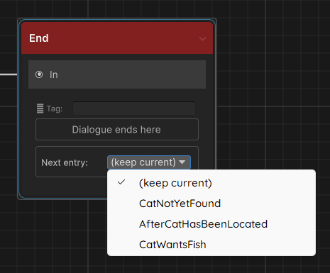

# Entry Points

Entry points let you jump to any node in a graph instead of always starting from the default start node. They are the primary mechanism for **branching narrative across multiple conversations** — an NPC who says different things before and after a quest, a cutscene that can start from different beats, a shop NPC with a special line once you've been friends for a while.

---

## Concepts

| Term | Meaning |
|---|---|
| **Start node** | Every graph has one — the node with the Start badge. This is the default entry. |
| **Entry point** | A named alias that maps a key string to a specific node GUID. Stored on the graph asset. |
| **Active entry point key** | A string held per-actor at runtime. When dialogue starts, this key is resolved to a node. Empty/null = use start node. |
| **Auto-switching** | End nodes have a **Next entry** dropdown — selecting a key automatically updates the actor's active entry point when that end node is reached. |

---

## Creating an entry point

### Step 1 — Mark a node

Right-click any node in the graph editor canvas → **Set as Entry Point**.

A text field appears in the popup. Type a short, descriptive key — e.g. `QuestDone`, `Repeat`, `PostBattle`. The key is case-sensitive everywhere.

The node gets a **yellow ⚑ badge** in the top-right corner. The key label is also displayed on the badge so you can see at a glance which entry points exist in the graph.

### Step 2 — Verify in the graph editor

The Inspector shows a summary count of entry points on the graph asset but not the individual keys. To verify, open the graph in the editor and look for the **yellow ⚑ badges** on nodes — each badge displays the key assigned to that node. If a node you intended to mark as an entry point has no badge, right-click it and set it again.

### Step 3 — Use the key

Leave the **Active Entry Point Key** field on `DialogueTrigger` or `NPCDialogue` empty to use the start node. Type any of your defined keys to start there instead. This field is directly editable and saved in the scene — useful for authoring a component that always starts partway through a graph (e.g. a tutorial skip).

---

## How the runner resolves an entry point

`DialogueGraph.ResolveEntryPointGuid(key)` is called at the start of every dialogue:

```csharp
public string ResolveEntryPointGuid(string key)
{
    if (!string.IsNullOrEmpty(key))
    {
        foreach (var ep in EntryPoints)
        {
            if (ep.Key == key)
                return ep.NodeGuid;
        }
        Debug.LogWarning($"[DialogueGraph] Entry point key '{key}' not found in '{name}'. " +
                         "Falling back to start node.");
    }
    return StartNodeGuid;
}
```

Key points:
- If `key` is null or empty, start node is used (no warning)
- If `key` is non-empty but not found in the `EntryPoints` list, a warning is printed and the start node is used — it does not throw
- Entry point lookup is a simple linear scan — keep count small; performance only matters for very large graphs with many entry points

---

## Runtime API

Both `DialogueTrigger` and `NPCDialogue` implement `IDialogueActor`:

```csharp
public interface IDialogueActor
{
    DialogueGraph Graph               { get; }
    string        ActiveEntryPointKey { get; }

    void SetEntryPoint(string key);   // switch to named branch
    void ResetEntryPoint();           // revert to default start node (sets key to null)
    void StartDialogue();             // begin dialogue from current entry point key
}
```

From any script:

```csharp
// Get the component — works whether it's a DialogueTrigger or NPCDialogue
IDialogueActor actor = npcObject.GetComponent<IDialogueActor>();

// Change the branch
actor.SetEntryPoint("QuestDone");

// Start immediately
actor.StartDialogue();

// Or just set it and let the player trigger it naturally
actor.SetEntryPoint("RepeatBranch");
```

Using `IDialogueActor` rather than the concrete type means your quest system, save system, and cutscene scripts don't need to know whether the NPC uses `DialogueTrigger` or `NPCDialogue` — the interface is the same.

### `SetEntryPoint(string key)`

Sets the actor's `ActiveEntryPointKey` to `key`. The change takes effect the next time `StartDialogue()` is called — it does not interrupt an in-progress dialogue.

### `ResetEntryPoint()`

Sets `ActiveEntryPointKey` to `null`. The next dialogue start will use the graph's default start node.

### `ActiveEntryPointKey`

Read-only property. Reflects the current key. Always check this when saving (see [Saving](saving.md)).

### Directly via `DialogueManager`

You can also call `StartDialogue` directly on the manager without going through the actor:

```csharp
DialogueManager.Instance.StartDialogue(graph, "QuestDone", actorComponent);
```

This does not update the actor's `ActiveEntryPointKey` — it just runs from that key for this one call. If you want the key to persist for next time, call `actor.SetEntryPoint("QuestDone")` first.

---

## Auto-switching with End nodes

Every **End Node** has a **Next entry** dropdown. When dialogue reaches this end node, the runner automatically calls `actor.SetEntryPoint(key)` with the selected key.

{ width="320" }

```csharp
// DialogueRunner.cs (simplified)
if (!string.IsNullOrEmpty(endNode.SetEntryPointOnComplete))
    actor?.SetEntryPoint(endNode.SetEntryPointOnComplete);
```

### Example pattern — quest-aware NPC

Suppose an NPC has three phases:

| When | Key | Branch content |
|---|---|---|
| First meeting | *(empty, start node)* | Introductory dialogue |
| Quest in progress | `InProgress` | Brief reminder |
| Quest complete | `QuestDone` | Reward dialogue + closure |

Graph setup:

1. **Start node** → introductory conversation → **End node** with **Next entry = InProgress**
2. `InProgress` entry point → reminder branch → **End node** with **Next entry = InProgress** *(stays in "in progress" branch until something changes it)*
3. `QuestDone` entry point → reward branch → **End node** *(leave Next entry as (keep current) — quest is done, no further switching needed)*

Your quest system changes the actor:

```csharp
void OnQuestCompleted()
{
    IDialogueActor npc = questNpc.GetComponent<IDialogueActor>();
    npc.SetEntryPoint("QuestDone");
}
```

The NPC now runs `QuestDone` on the player's next interaction, regardless of whether they spoke to him before or after completing the quest.

---

## DialogueTrigger-specific fields

`DialogueTrigger` has an **Active Entry Point Key** field directly in the Inspector. This is a serialized field — you can set it at design time for NPCs that always start partway through a graph without any C# code.

At runtime, `TriggerDialogue()` always passes `activeEntryPointKey` to `DialogueManager.StartDialogue`. If `DialogueManager` is missing or `graph` is null, an error is logged and nothing happens.

Interaction flow with a trigger collider:

1. Player enters trigger zone → `playerInRange = true`, interact prompt shown (if assigned)
2. Player presses `InteractKey` (or `Start On Enter = true`) → `TriggerDialogue()` is called
3. `TriggerDialogue` calls `DialogueManager.Instance.StartDialogue(graph, activeEntryPointKey, this)`
4. Dialogue runs from the resolved node

---

## Saving and restoring the active entry point

The `ActiveEntryPointKey` is a plain string at runtime — not automatically persisted. Save and restore it with your existing save system:

```csharp
// --- Saving ---
string savedKey = npc.GetComponent<IDialogueActor>().ActiveEntryPointKey;
// Write savedKey to PlayerPrefs, JSON, etc.

// --- Loading ---
string savedKey = /* load from your save system */;
npc.GetComponent<IDialogueActor>().SetEntryPoint(savedKey); // null or "" restores the default
```

For a convenient wrapper, implement save/load directly on the actor:

```csharp
public class NPCDialogueWithSave : NPCDialogue
{
    public string SaveKey => $"ep_{gameObject.name}";

    public void Save() =>
        PlayerPrefs.SetString(SaveKey, ActiveEntryPointKey ?? "");

    public void Load() =>
        SetEntryPoint(PlayerPrefs.GetString(SaveKey, ""));
}
```

See [Saving](saving.md) for a full discussion including variables and choice history.

---

## Multiple entry points on the same graph

There is no limit to the number of entry points on a graph. Complex NPCs might have ten or more:

```
Start        — first meeting
AfterBanquet — next morning after the banquet scene
QuestActive  — while quest is running
QuestDone    — after quest is complete
Hostile      — if player attacked a villager
Friend       — high affinity branch
```

Use the **yellow badges** and the Entry Points list on the graph asset to keep track of them. Group related branches with **Comment Boxes** in the editor so the canvas doesn't become confusing.

---

## Edge cases

### Entry point on a Jump Node

You can set an entry point on a Jump Node. Execution will immediately jump to the tagged node — it will never display any content at the entry point node itself. This can be used as an indirection layer:

```
Entry "Retry" → Jump Node [tag: FirstLine]
              → First NPC Node
```

### Entry point on an End Node

Technically valid. Dialogue will end immediately on starting. Rarely useful, but it won't crash — the runner sees the end node and calls `HandleEnd`.

### Changing the entry point mid-dialogue

Calling `actor.SetEntryPoint(key)` while a dialogue is running is safe (it's just a string assignment) but the current dialogue is not affected. The key only takes effect on the *next* `StartDialogue` call. If you need to jump within a running dialogue, use a **Jump Node** connected by the graph.

### Entry point not found — warning, not error

If you call `SetEntryPoint("Typo")` and `"Typo"` doesn't exist in the graph, `ResolveEntryPointGuid` logs a warning and falls back to the start node. Check the Console for these warnings during QA — they signal a graph/code mismatch.
