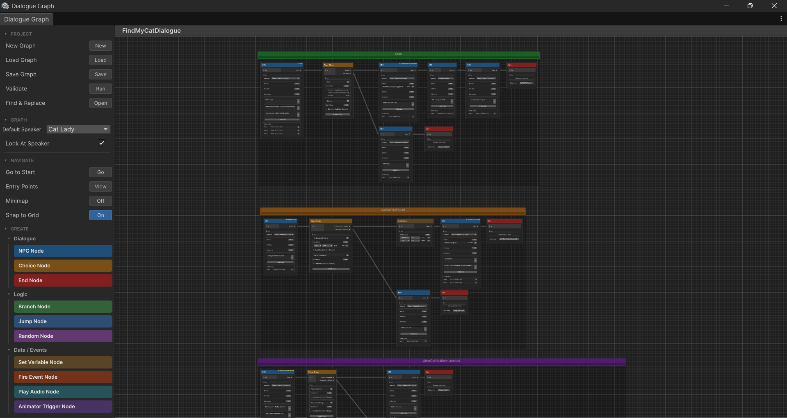
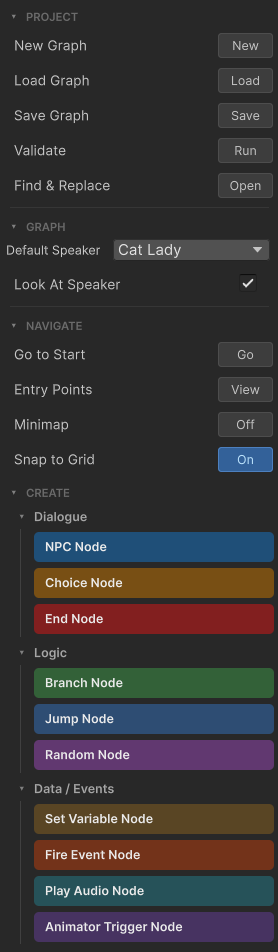
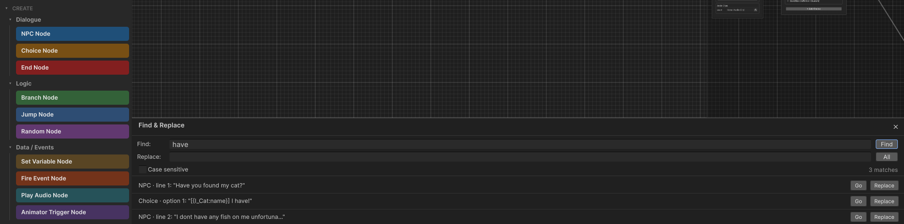
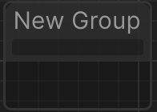
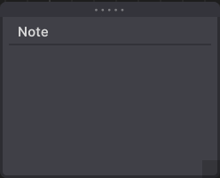

# Graph Editor

The graph editor is the primary authoring tool in Threader. It opens as a Unity EditorWindow and runs entirely in edit mode — no Play mode required to build or preview dialogues.

---

## Opening the editor

Double-click any **Dialogue Graph** asset in the Project window. The editor opens and loads that graph automatically. You can also open it via **Threader → Graph Editor** in the Unity menu bar and then load a graph from the sidebar.

**Threader → Help & Documentation** opens the online documentation in your default browser.

---

## Layout

The editor is split into two panels separated by a draggable divider:

- **Left panel — Sidebar**: project operations, graph settings, navigation, and node creation
- **Right panel — Canvas**: infinite scrollable graph canvas where nodes live

Both panels remember their sizes between sessions via EditorPrefs.

{ width="720" }

---

## Canvas controls

| Action | How |
|---|---|
| Pan | Middle-mouse drag, or Alt + left-drag |
| Zoom | Scroll wheel. Range: 0.05× to 5× |
| Select a node | Left-click |
| Multi-select | Left-drag a box, or Shift+click individual nodes |
| Move nodes | Left-drag selected nodes |
| Connect nodes | Drag from an output port to an input port |
| Disconnect an edge | Right-click the edge → Delete, or select and press Delete |
| Context menu | Right-click on the canvas background or a node |
| Frame selected | `F` |
| Frame all | `A` |

---

## Sidebar sections

{ width="280" }

### PROJECT

| Button | What it does |
|---|---|
| **New** | Prompts for a name and creates a new `DialogueGraph` asset in the currently selected folder |
| **Load** | Opens an object picker to load an existing graph |
| **Save** | Writes all unsaved changes to the asset on disk (`Ctrl+S` also works) |
| **Validate** | Runs the graph validator and shows a list of warnings/errors inline |
| **Find & Replace** | Opens the find/replace panel (see below) |

An orange **● Unsaved** indicator appears in the toolbar whenever the graph has changes not yet written to disk. Closing the window or switching graphs while unsaved changes are present will prompt you to save.

### GRAPH

| Field | Description |
|---|---|
| **Default Speaker** | Fallback speaker name for any NPC node whose own Speaker field is blank. Populated from your SpeakerRoster assets. Nodes with no override show `(Graph Default: X)` in their dropdown, updating live as you change this value. |
| **Look At Speaker** | When ticked, any scene object that implements `IDialogueFocus` (e.g. a first-person camera controller) will automatically rotate to face the current speaker's transform each time an NPC node fires. Toggle this per-graph. |

### NAVIGATE

| Button / Control | What it does |
|---|---|
| **Go to Start** | Pans and zooms the canvas to frame the start node |
| **Entry Points** | Lists all named entry points defined in the graph; click any to jump there |
| **Minimap** | Toggles the floating minimap overlay (preference saved per session) |
| **Snap to Grid** | Snaps all node movement to a 20 px grid (preference saved per session) |
| **Show GUIDs** | Displays each node's full GUID as small text at the bottom of the node header. Useful when cross-referencing GUIDs from error messages. Preference is saved via EditorPrefs and restored across sessions. |
| **Search GUID** | Text field + **Go** button. Paste a full GUID or the 8-character prefix shown in error messages, then press Go or Enter to pan and select the matching node. |

### CREATE

A set of colour-coded pills for every node type, grouped into categories:

- **Dialogue** — NPC Node, Player Choice Node, End Node
- **Logic** — Branch Node, Jump Node, Random Node
- **Data / Events** — Set Variable Node, Fire Event Node, Play Audio Node, Animator Trigger Node
- **Utility** — Debug Node, Wait Node, Group, Sticky Note

**Click** a pill to create the node at the canvas centre.  
**Drag** a pill directly onto the canvas to place it at the drop position.

---

## Keyboard shortcuts

| Key | Action |
|---|---|
| `N` | Create NPC Node |
| `C` | Create Player Choice Node |
| `E` | Create End Node |
| `D` | Create Debug Node |
| `J` | Create Jump Node |
| `B` | Create Branch Node |
| `V` | Create Set Variable Node |
| `R` | Create Random Node |
| `F2` | Create Fire Event Node |
| `F3` | Create Play Audio Node |
| `F4` | Create Animator Trigger Node |
| `F5` | Create Wait Node |
| `G` | Group selected nodes into a comment box |
| `Z` | Add a sticky note at the cursor position |
| `F` | Frame / zoom to selected nodes |
| `A` | Frame all nodes |
| `Space` | Open node search window |
| `Ctrl+D` | Duplicate selected nodes |
| `Ctrl+C` / `Ctrl+V` | Copy and paste selected nodes |
| `Ctrl+Z` | Undo last graph change |
| `Delete` / `Backspace` | Delete selected nodes or edges |
| `Ctrl+S` | Save graph |

> Typing shortcuts are blocked while a sticky note, text field, or other input control has focus — you won't accidentally create nodes while typing dialogue text.

---

## Node context menu

Right-click any node to open its context menu:

| Option | Effect |
|---|---|
| **Set as Start Node** | Makes this node the graph's entry point (green ▶ START badge) |
| **Set as Entry Point…** | Opens a dialog to assign a named entry-point key to this node (yellow ⚑ badge appears) |
| **Remove Entry Point** | Clears the entry point key from this node |
| **Set Colour** | Opens the colour picker (None / Red / Orange / Yellow / Green / Blue / Purple) |
| **Duplicate** | Creates a copy of the node with a new GUID, positioned slightly offset |
| **Copy GUID** | Copies the node's full GUID to the clipboard. Useful for pasting into the **Search GUID** field or external tools. |
| **Delete** | Removes the node and all edges connected to it |

A 4 px accent border on the left side of the node shows any assigned colour. The colour is purely organisational — it has no effect on execution.

---

## Find & Replace

Open via **PROJECT → Find & Replace** in the sidebar. Searches all NPC line text and Player Choice button text in the currently loaded graph.

| Field | Description |
|---|---|
| **Find** | Type a term and press Enter or click **Find** to search |
| **Replace** | The replacement text |
| **Case Sensitive** | Toggle; re-runs the search automatically when changed |
| **Results list** | Each match shows: speaker name or type, line index, and a preview snippet |

Per-result buttons:

- **Go** — selects and frames that node in the graph
- **Replace** — replaces that single occurrence (undoable)
- **All** — replaces every match at once (undoable, single undo step)

After any replacement the graph view refreshes and the search re-runs automatically so remaining matches are immediately visible.

{ width="680" }

---

## Comment / Group boxes

{ width="260" }

Select one or more nodes and press **G** (or drag the **Group** pill from the sidebar) to wrap them in an organisational comment box.

- **Double-click** the title to rename it
- Click the **Notes** text area below the title to type multi-line annotations (saved with the graph)
- **Right-click** the group to change its colour (Default / Red / Orange / Yellow / Green / Blue / Purple) or delete it
- **Drag nodes** in and out of a group to include or exclude them
- **Sticky notes** can also be dragged into a group; they snap in and are saved as part of that group

Groups are purely visual — they have no effect on dialogue execution.

---

## Sticky notes

{ width="200" }

Press **Z** or right-click the canvas → **Add Sticky Note** to place a free-floating annotation anywhere on the canvas.

- Click the title or body to edit the text inline
- Drag by the title bar to reposition
- Drag the bottom-right corner handle to resize
- Drag onto a Group box to attach it to that group

**Right-click** a sticky note for:

| Menu | Options |
|---|---|
| Theme | Classic / Black / Dark / Orange / Red / Purple / Teal |
| Font Size | Small / Medium / Large / Huge |

Sticky notes are saved with the graph asset and are never shown at runtime.

---

## Dialogue Preview Window

The preview window is covered on its own page — see [Dialogue Preview Window](preview-window.md).

---

## Validation

Click **Validate** in the sidebar PROJECT section to run a static check over the loaded graph. Results appear in a panel at the bottom of the editor window. Each issue lists a description and a **Go** button to jump directly to the offending node.

### Reading console errors

All runtime `LogError` and `LogWarning` messages from Threader include the **graph name**, **node type**, and a **short node ID** (8-character GUID prefix). Example:

```
[Threader] JumpNode 'a3f9c812' in graph 'VillagerGraph': tag 'shop_loop' not found on any node.
```

Paste the 8-char prefix into the **Search GUID** field in the NAVIGATE sidebar and press **Go** to jump straight to that node. Clicking the console entry pings the source graph asset in the Project window.

> Unity does not support opening a custom editor window from a console double-click (that callback is reserved for `.cs` files). The asset ping is the closest equivalent.

The validator checks for:

- No Start node set on the graph
- NPC node has no lines, or all lines have blank text
- NPC node output is not connected
- NPC node speaker name is not found in any assigned Speaker Roster (only checked when a roster is assigned)
- Player Choice node has no choices
- Player Choice node has a choice with blank text (reported as “choice N has blank text”)
- Player Choice node has a choice with no outgoing connection
- Branch node has no conditions (always takes False path)
- Branch node True or False output is not connected
- Jump node has no target tag set
- Jump node target tag does not exist on any node in the graph
- Set Variable node has no actions
- Set Variable node output is not connected
- Random node has no outputs, or all outputs are unconnected
- End node **Next entry** key references an entry point not defined in this graph
- Named entry point references a node that no longer exists
- A node with **Prevent Dialogue Exit** enabled has no reachable End node (would leave the player permanently stuck)

**Live validation**: while the validator panel is open, it re-runs automatically whenever nodes or edges change. Close the panel to stop live updates.

---

## After a script recompile

Unity recompiles all scripts when you save a `.cs` file. The graph editor re-loads automatically after a recompile. If the canvas appears empty after a recompile, click **Load** in the sidebar or close and re-open the window.
