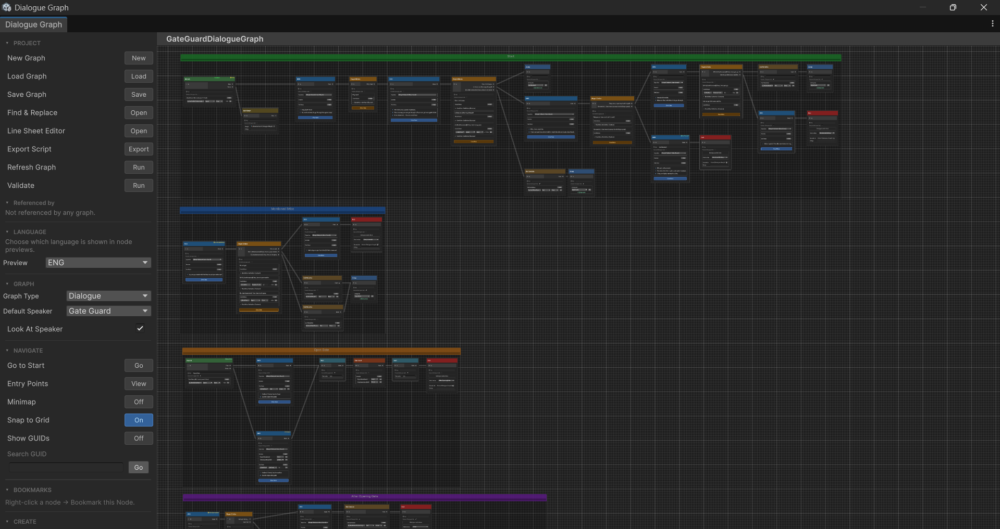

# Threader - Dialogue Kit

**Visual Dialogue System for Unity** — build branching conversations with a node-based graph editor, no boilerplate required.

v1.0 &nbsp; <a href="https://discord.gg/nb8HCuX2h5" style="background:#5865F2;color:#fff;padding:3px 10px;border-radius:4px;font-size:0.85em;font-weight:bold;text-decoration:none;">Discord</a>

{ width="720" }

---

## Features

- **Visual graph editor** — drag, connect, and organise nodes on an infinite canvas
- **15 node types** — NPC lines, player choices, branching, switch, weighted random, sub-graphs, variables, audio, animator triggers, events, waits, and more
- **Sub-graph system** — call any dialogue graph from within another and return — exactly like a function call
- **Bark system** — fire-and-forget ambient lines that run in parallel without blocking the player
- **Line Sheet system** — per-graph companion assets that store per-speaker audio clips and animator actions for every NPC line; supports multiple speakers sharing the same graph
- **Multi-language support** — assign multiple line sheets per graph (one per language) and switch at runtime with `SetActiveLanguage()`; line text and choice text are automatically resolved from the active language's sheet
- **Language Library** — optional central asset that defines project-wide languages, auto-populating language slots on every graph for typo-free setup
- **Node templates** — save any selection of nodes as a reusable drag-to-stamp template
- **Built-in variable store** — Bool / Int / String variables with inline type-aware conditions on choices — no C# needed
- **Text token substitution** — embed variable values directly in dialogue: `You have {gold} {gold:name}`
- **Entry points** — jump into any branch of a graph based on story state
- **Spatial audio** — per-speaker 3D audio source positioning
- **Animator integration** — set parameters on any registered speaker's Animator
- **Custom conditions** — register C# delegates or a `ConditionProvider` asset for complex game state
- **Edit-mode preview window** — step through any graph without entering Play mode
- **Bookmarks** — pin any node to the sidebar for one-click navigation in large graphs
- **Export script** — export any graph as a plain-text screenplay for VO sessions or writer review
- **Choice history** — track visited choices with save/load serialization
- **Singleton `DialogueManager`** — one component drives everything; subscribe to events from any script

---

## Minimum setup

Seven steps to a working dialogue:

1. **Create** a [Speaker Roster](speaker-roster.md) — right-click in the Project window → **Create → Threader → Speaker Roster**, then add your speaker names
2. **Create** a [Variables Store](variables.md) *(optional)* — **Create → Threader → Variables Store**, then add any variables your dialogue needs
3. **Create** a [Dialogue Graph](graph-editor.md) — **Create → Threader → Dialogue Graph**, then double-click it to open the graph editor and build your conversation
4. **Add** a `DialogueManager` component to an empty GameObject in the scene — assign your Speaker Roster and Variables Store
5. **Add** an `NPCDialogue` or `DialogueTrigger` component to your NPC — assign the graph and speaker name
6. **Wire** the UI — add `DialogueUI` to a GameObject (with `UI_Dialogue.uxml`), or subscribe to `OnNPCLine` / `OnChoiceNode` for a fully custom UI
7. **Play** and interact with the NPC to start the conversation

→ See [Quick Start](quick-start.md) for the full step-by-step walkthrough with detailed explanations.

---

## Navigation

| Section | What's in it |
|---|---|
| [Quick Start](quick-start.md) | End-to-end setup in ~10 minutes |
| [Tutorial](tutorial.md) | Guided walkthrough building a complete dialogue scene |
| [Graph Editor](graph-editor.md) | Canvas controls, sidebar, shortcuts, tools |
| [Dialogue Preview](preview-window.md) | Step through graphs in edit mode without entering Play mode |
| [Node Reference](nodes.md) | All 15 node types with field descriptions |
| [Variables](variables.md) | Variable store, set actions, text tokens |
| [Conditions](conditions.md) | Inline conditions and C# custom conditions |
| [Events](events.md) | Node events, global events, and C# event subscriptions |
| [Speaker Roster](speaker-roster.md) | Speaker name assets, NPCDialogue setup, and name resolution |
| [Sub-Graph](sub-graph.md) | Call any graph from within another and return |
| [Bark System](bark.md) | Ambient fire-and-forget lines that don't block the player |
| [Line Sheet](line-sheet.md) | Per-speaker audio clips and animator actions for NPC lines |
| [Translation](translation.md) | Multi-language setup, Language Library, and runtime language switching |
| [Node Templates](templates.md) | Save and stamp node selections as reusable templates |
| [UI](ui.md) | Built-in DialogueUI, Canvas/uGUI custom UI, and event hooks |
| [Entry Points](entry-points.md) | Multi-branch graphs and state persistence |
| [Saving](saving.md) | Persisting variables, choices, and entry points |
| [API Reference](api-reference.md) | Events, interfaces, and code API |
| [Troubleshooting](troubleshooting.md) | Solutions to common problems and how to report bugs |
| [Roadmap](roadmap.md) | What's coming in upcoming releases |
| [Changelog](changelog.md) | Full version history |
