# Node Reference

Threader has 15 node types. This page documents every field and the exact order in which things happen at runtime.

All nodes share:

- **⚐ Tag field** — a string identifier used as a Jump target. Set this on any node you want a Jump Node to redirect to. Leave blank if this node is never a jump target. Tags must be unique within a graph.
- **Prevent Dialogue Exit toggle** — when enabled, `DialogueManager.CancelDialogue()` and the built-in Escape-key handler are ignored while this node is active. Use to protect nodes that write variables, grant rewards, or play mandatory cutscene lines. The validator will warn you if a locked node has no reachable End node (which would leave the player permanently stuck).
- **Right-click context menu** — Set as Start Node, Set as Entry Point, Remove Entry Point, Set Colour, Bookmark this Node, Duplicate, Delete, Copy GUID.

> **Bark graphs** (graphs with **Graph Type** set to **Bark** in the GRAPH sidebar) do not support Player Choice Node, Wait Node, or Sub Graph Node. These node types are hidden from the sidebar and right-click context menu when a bark graph is open.

---

## NPC Node `[N]`

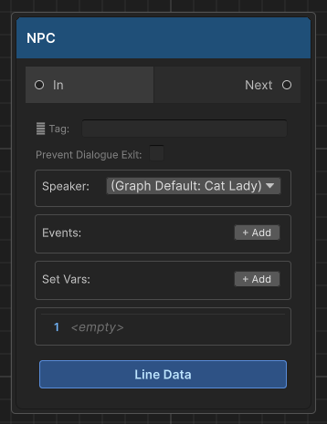{ width="260" }

Shows one or more spoken lines from a character. The runner pauses after displaying each line and waits for the player to advance before moving to the next line. When all lines are shown, execution moves to the connected output node.

### Execution order

1. **Set Vars** actions are applied to `DialogueVariables` (in list order)
2. **Events** are fired — local events trigger `OnNodeEvent`; global events also trigger `OnGlobalNodeEvent`
3. `OnNPCNode` fires on the `DialogueRunner`, which the `DialogueManager` catches to begin line playback
4. Each **Line** in the list is displayed in sequence — `OnNPCLine` fires per line, then the UI typewriter runs, then the per-line `linePause` delay, then the player advances (or space-to-skip)
5. After the last line, `Continue()` is called and execution moves to the next connected node

### Fields

#### Speaker

The name of the character speaking. Must exactly match the `Speaker Name` field on the `NPCDialogue` component in the scene.

- Leave blank to inherit the graph's **Default Speaker**
- Used for: camera look-at target, Animator resolution, 3D spatial audio positioning
- If the name is set but no matching `NPCDialogue` is found in the scene, a warning is logged and the line is still displayed (just without look-at/audio positioning)

#### Events (+ Add)

Fires named string events when this node is reached (before lines are shown).

| Field | Description |
|---|---|
| Key | The event string. Received by `OnNodeEvent` subscribers and `NPCDialogue.NodeEvents` response list |
| Global | Off = Local: only fires `OnNodeEvent`. Guard your handler with `CurrentActor` to scope it to this NPC. On = Global: also fires `OnGlobalNodeEvent`. No guard needed — intentionally broadcast to all listeners. |

Multiple events are fired in list order. Empty keys are skipped.

#### Set Vars (+ Add)

Applies variable write operations the moment this node is reached, **before** events fire.

| Field | Description |
|---|---|
| Variable Name | Dropdown of variable names from all assigned `DialogueVariables` assets |
| Operator | `Set` / `Add` / `Subtract` / `Toggle` |
| Value | Operand string. Use `true`/`false` for Bool. Ignored for Toggle. |

Operations by type:

| Operator | Bool | Int | String |
|---|---|---|---|
| Set | `var = value` | `var = value` | `var = value` |
| Add | *(unsupported)* | `var += value` | *(unsupported)* |
| Subtract | *(unsupported)* | `var -= value` | *(unsupported)* |
| Toggle | `var = !var` | *(unsupported)* | *(unsupported)* |

#### Lines

The node shows a read-only preview of its lines. To add or edit lines, click the **Line Data** button at the bottom of the node — a popup opens where you can:

- **Add / remove lines** with the + Add Line button
- **Edit the text** of each line directly in the popup
- **Assign an audio clip** per speaker per line
- **Add animator actions** per speaker per line

Each line's text field supports `{varName}` and `{varName:name}` tokens (see [Variables — text substitution](variables.md#variable-substitution-in-text)).

---

## Player Choice Node `[C]`

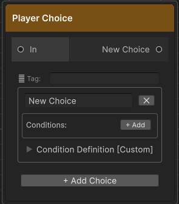{ width="260" }

Presents the player with a list of choices. Each choice is its own output port connecting to a separate branch. Unlike NPC nodes, the runner does **not** auto-advance — it waits for `SelectChoice(index)` to be called, which your UI does when the player clicks a button.

### Execution order

1. Runtime keys are stamped on each choice: `{nodeGuid}:{choiceIndex}`
2. Conditions are evaluated on each choice (inline variable conditions first, then ConditionDefinition)
3. `OnChoiceNode` fires with the evaluated list
4. UI displays choices; player picks one
5. `SelectChoice(index)` is called → execution follows that choice's output port

### Fields

#### Choice cards (+ Add Choice)

Each card has:

| Field | Description |
|---|---|
| Text | The choice label shown to the player. Supports `{varName}` tokens. |
| Output port | Drag from this port to the node for this branch |
| ✕ button | Removes this choice card and its output port |

#### Conditions (+ Add inside a choice card)

All condition rows use AND logic — every row must pass for the choice to be selectable.

| Field | Description |
|---|---|
| Variable | Dropdown of names from your `DialogueVariables` assets |
| Operator | Equal / NotEqual / GreaterThan (`>`) / GreaterOrEqual (`>=`) / LessThan (`<`) / LessOrEqual (`<=`). Numeric operators are hidden automatically for Bool and String variables. |
| Value | **Type-aware field** — checkbox for Bool, integer field for Int, text field for String. Updates automatically when you change the variable. |
| Hide | **Checked** = completely hide this choice when the condition fails. **Unchecked** = show greyed-out and locked. |
| NOT | Inverts this individual row's result before it contributes to the AND chain |
| ✕ | Removes this condition row |

When a condition fails and **Hide is unchecked**, the choice shows in the UI with an `is-locked` USS class — typically rendered greyed out and unclickable, with `IsLocked = true` on the `ChoiceData`.

When **Hide is checked**, `IsHidden = true` on the `ChoiceData` and the built-in `DialogueUI` removes it from the list entirely. If you build a custom UI, filter out `IsHidden` choices before rendering.

#### Condition Definition `[Custom]` (foldout inside each choice card)

An optional advanced condition linking a `ConditionDefinition` asset to a C# handler. Expand the **Condition Definition [Custom]** foldout inside the choice card.

| Field | Description |
|---|---|
| Asset field | Click the object picker (⊙) and select a `ConditionDefinition` ScriptableObject |
| Parameter | String passed to `ConditionService.Evaluate(def, param)` |
| Negate | Inverts the C# condition result |

This condition is evaluated **after** all inline variable conditions. If any inline condition already failed, this is not evaluated (the choice is already locked).

> The **Condition Definition** foldout auto-expands when an asset is already assigned.

---

## End Node `[E]`

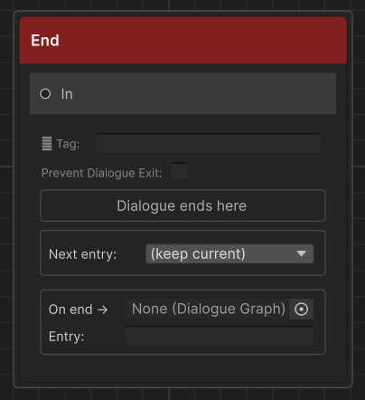{ width="260" }

Terminates the current dialogue. Clears `CurrentActor`, releases blocking, hides the UI, then fires `OnDialogueEnd` and `OnDialogueEnded`. `CurrentActor` is already `null` by the time `OnDialogueEnd` subscribers are notified.

### Fields

#### Next entry (dropdown)

Sets the actor's active entry point for the **next** conversation **before** dialogue ends.

| Value | Effect |
|---|---|
| *(keep current)* | Actor's entry point is unchanged after this conversation |
| Any named key | Actor's `ActiveEntryPointKey` is set to that key automatically |

This is how you advance NPC story state without a single line of code. Only entry points defined in the **current graph** appear in the dropdown.

See [Entry Points](entry-points.md) for the full workflow.

#### On end → (sub-graph slot)

An optional `DialogueGraph` asset field and entry point key. When a graph is assigned here:

1. The `Next entry` switch fires first — the actor's entry point is updated
2. The assigned graph runs as a sub-routine
3. When that sub-graph's End node is reached, the conversation truly closes

This is useful for routing a quest NPC back to generic idle lines automatically when a unique quest conversation ends — without duplicating a single line.

---

## Branch Node `[B]`

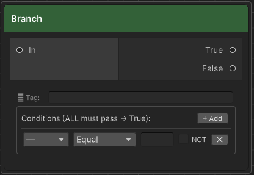{ width="260" }

Silently evaluates one or more variable conditions and routes execution to a **True** or **False** output port. No dialogue is shown — execution passes through immediately.

### Execution order

1. All condition rows are evaluated in list order (AND logic)
2. If all pass → True port is followed
3. If any fail → False port is followed
4. If a port has no connection → dialogue ends

### Fields

Conditions use the same fields as Player Choice inline conditions (Variable, Operator, Value, NOT, ✕), but there is no Hide checkbox — Branch nodes are never visible to the player.

The **Negate** toggle on each condition row inverts that row's result before it contributes to the AND chain, exactly as it works on Player Choice inline conditions.

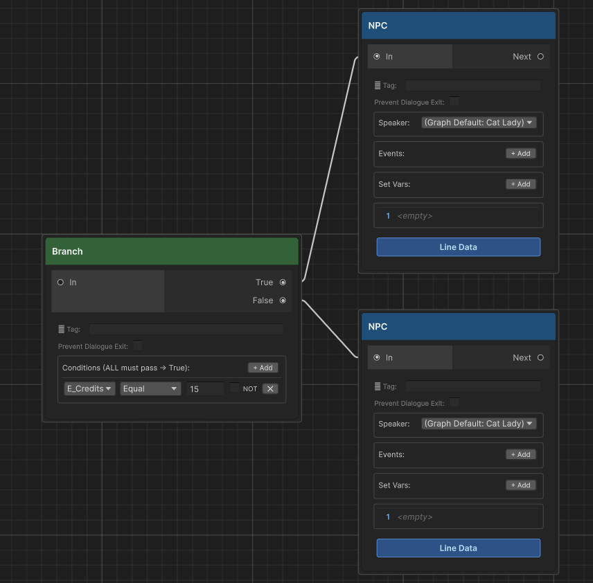{ width="600" }

---

## Switch Node `[S]`

Silently evaluates multiple named cases in order and routes execution to the first case whose conditions all pass. If no case matches, execution follows the **Default** output. No dialogue is shown — execution passes through immediately.

Use Switch nodes when you have more than two possible paths based on variable state — for example, routing to different dialogue branches depending on a quest phase (not started / in progress / complete / failed).

### Execution order

1. Cases are evaluated top-to-bottom in list order
2. Each case evaluates all its condition rows with AND logic (same as Branch)
3. The **first case** where all conditions pass wins — execution follows that case's output port
4. If **no case** passes → the Default output port is followed
5. If the selected port has no connection → dialogue ends

### Fields

#### Cases (+ Add Case)

Each case has:

| Field | Description |
|---|---|
| **Label** | A human-readable name for the case (displayed on the node and in the editor). Purely organisational — has no effect on execution. |
| **Conditions** (+ Add) | One or more variable conditions using the same fields as Branch Node conditions (Variable, Operator, Value, NOT). All conditions use AND logic. |
| **Output port** | Drag from this port to the node for this case's branch |
| **✕** | Removes this case |

#### Default output

A separate output port that fires when none of the cases match. Always present — cannot be removed.

---

## Weighted Random Node `[W]`

Picks one of its output ports at random using **weighted probability**. Outputs with higher weights are selected more often. No dialogue is shown — execution passes through immediately.

Use Weighted Random when you want some outcomes to be more likely than others — for example, a common greeting 70% of the time and a rare greeting 10% of the time.

### Fields

#### Outputs (+ Add Output)

Each output has:

| Field | Description |
|---|---|
| **Weight** | A float value (minimum 0). Higher values mean higher probability relative to other outputs. |
| **Output port** | Drag from this port to the node for this branch |
| **✕** | Removes this output |

Weights are relative — they do not need to sum to 1 or 100. The probability of each output is `weight / totalWeight`. For example, if three outputs have weights 3, 2, and 1, their probabilities are 50%, 33%, and 17%.

At least one output with a weight greater than 0 is required. If a selected output has no connection, dialogue ends.

> For equal-probability random selection, use the [Random Node](#random-node-r) instead.

---

## Sub Graph Node `[F6]`

Delegates execution to another `DialogueGraph` asset, then returns and continues from the connected output — exactly like a function call in code. Use it to share common dialogue sequences (generic greetings, shop flows, idle lines) across many different NPC graphs without duplicating content.

### Fields

| Field | Description |
|---|---|
| **Graph** | The `DialogueGraph` asset to call. Drag from the Project window or use the object picker. |
| **Entry Point** | Optional entry point key. Leave blank to start from the sub-graph's default start node. |

### Speaker resolution

NPC nodes inside the sub-graph resolve speaker name through a three-level chain:

1. **Node Speaker** — the speaker set directly on that NPC node
2. **Graph Default Speaker** — the `DefaultSpeakerName` set on the sub-graph itself
3. **Calling actor's speaker name** — the `SpeakerName` from the `IDialogueActor` that started the top-level conversation

This means a shared graph with blank speaker fields will automatically display and look at whoever triggered the dialogue — no extra setup required.

### Depth limit

Sub-graphs can be nested up to 16 levels deep. Exceeding this limit logs an error and ends the dialogue cleanly to prevent infinite loops.

### End Node "On end →" sub-graph slot

The **End Node** has an optional graph reference and entry point key in its **On end →** section. When set, that graph runs as a sub-routine before the conversation truly closes — useful for routing an NPC back to generic idle lines after a quest-specific conversation. The `Next entry` switch fires first so the actor's entry point is already updated while the sub-graph plays.

> **Not available in bark graphs.** Sub Graph Node is hidden from the sidebar and context menu when **Graph Type** is set to **Bark**.

See [Sub-Graph](sub-graph.md) for full patterns and use-case walkthroughs.

---

## Set Variable Node `[V]`

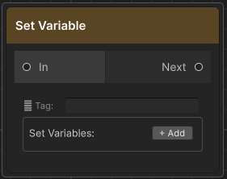{ width="260" }

Silently applies one or more variable write operations and advances. No dialogue is shown.

Use this when you need to write variables at a precise point in the flow without attaching the action to an NPC node. Useful for:

- Setting flags at the start or end of a branch
- Initialising counters before a looping section
- Marking story progression at dead-end branches

### Fields

Same as the **Set Vars** section on a NPC Node (Variable Name, Operator, Value). Multiple rows are applied in list order.

The value field is **type-aware** — it shows a checkbox for Bool variables, an integer field for Int variables, and a text field for String variables. The operator dropdown hides options that don't apply to the selected type (`Add`/`Subtract` hidden for Bool/String; `Toggle` hidden for Int/String; value field hidden entirely when operator is Toggle).

---

## Random Node `[R]`

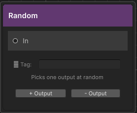{ width="260" }

Picks one of its output ports at random each time it is reached. Every output has **equal probability** — there is no weighting system.

### Fields

| Control | Description |
|---|---|
| **+ Output** | Adds a new output port (labelled Output 1, Output 2, …) |
| **− Output** | Removes the last output port |

Each output port connects to a separate branch. At least one output is required. If a selected output has no connection, dialogue ends.

**Practical uses**: ambient NPC variety (different greetings on repeat visits), randomised story fragments, loot tables embedded in narrative.

---

## Jump Node `[J]`

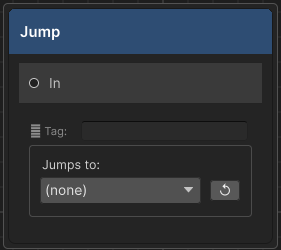{ width="260" }

Redirects execution to any node in the same graph identified by its **⚐ Tag** (Return Tag). Has no output port. Execution jumps immediately — no dialogue is shown.

Use Jump nodes to:

- **Loop** back to an earlier part of the graph (e.g. repeat a menu until the player picks "Goodbye")
- **Share a common ending** branch from multiple paths without drawing crossing edges
- **Avoid long edges** across large graphs

### Fields

| Field | Description |
|---|---|
| **Jumps to** (dropdown) | Lists every ⚐ Tag set on a node in this graph. Select the target tag. |
| **↺ Refresh** | Re-scans the graph for tags added after this Jump Node was placed |

The jump target is resolved by tag string at runtime. If the tag no longer exists in the graph when dialogue runs, the runner logs an error and ends the dialogue.

> Set the ⚐ Tag on the **target node**, not on the Jump Node itself.

---

## Debug Node `[D]`

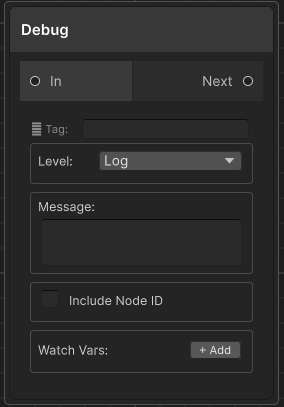{ width="260" }

Logs a message to the Unity Console when reached. Passes through silently — the player never sees it. Execution continues to the connected output node immediately.

### Fields

| Field | Description |
|---|---|
| **Level** | Log (white), Warning (yellow — node title bar turns yellow), Error (red — node title bar turns red) |
| **Message** | Text written to the Console. Multiline. |
| **Include Node ID** | Prepends the node's short GUID to the message, useful when multiple Debug nodes log similar text |
| **Watch Vars** (+ Add) | Variable name dropdown. The current runtime value of each listed variable is appended to the log output, e.g. `[foundCat=true] [gold=42]` |

The console prefix is color-coded by level: `[<color=cyan>DialogueDebug</color>]` for Log, yellow for Warning, red for Error — matching the color conventions used by all other Threader runtime logs.

---

## Wait Node `[F5]`

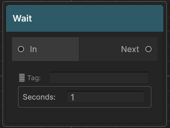{ width="260" }

Pauses execution for a set duration in real-time seconds, then advances silently. No dialogue is shown.

Internally, `DialogueManager` starts a coroutine that calls `runner.Continue()` after the delay. The wait cannot be skipped by the player — it runs to completion regardless of input.

In the **Dialogue Preview Window**, the wait is skipped instantly so you can step through graphs without sitting through delays.

### Fields

| Field | Description |
|---|---|
| **Seconds** | Float, minimum 0. A value of 0 advances on the next frame. |

**Practical uses**: dramatic pauses between automatic lines, pacing cutscene sequences, spacing between timed Play Audio clips.

---

## Fire Event Node `[F2]`

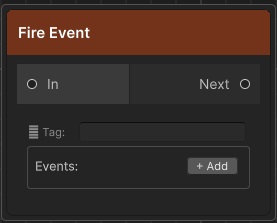{ width="260" }

Silently broadcasts one or more named events and advances. No dialogue is shown. Uses the same `OnNodeEvent` / `OnGlobalNodeEvent` callbacks as NPC node events.

Use this when you need to trigger a game system at a precise point in the conversation flow without attaching the event to an NPC speak node — for example, triggering a door to open between two branches, or spawning an enemy after a dramatic reveal.

### Fields

| Field | Description |
|---|---|
| **Key** | The event string. Received by `OnNodeEvent` subscribers. |
| **Global** | Off = Local (fires `OnNodeEvent` only). On = Global (fires both `OnNodeEvent` and `OnGlobalNodeEvent`). |
| **✕** | Removes this event row |

Multiple events are fired in list order.

---

## Play Audio Node `[F3]`

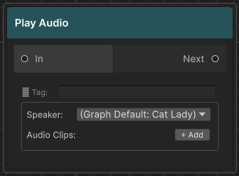{ width="260" }

Plays one or more `AudioClip` assets and **advances immediately** — it does not wait for playback to finish. All clips fire in list order via the `DialogueManager`'s audio sources.

### Fields

| Field | Description |
|---|---|
| **Speaker** | Name of the registered speaker whose world position is used for 3D spatial audio. Leave blank to fall back through: graph's **Default Speaker** → current actor's speaker name. If none resolves or no matching speaker is registered, the 2D fallback `AudioSource` on the `DialogueManager` is used instead. |
| **Audio Clips** (+ Add) | `AudioClip` object fields. Drag assets in. Null slots are skipped. |
| **✕** | Removes a slot |

If a matching speaker transform is found, the spatial `AudioSource` is repositioned to that transform and plays with full 3D (`spatialBlend = 1`). If not, the 2D `AudioSource` plays instead.

> Because Play Audio Node advances immediately, it's best for short stings and sound effects. For per-speaker voice lines that the dialogue waits for, assign clips in the graph's [Line Sheet](line-sheet.md).

---

## Animator Trigger Node `[F4]`

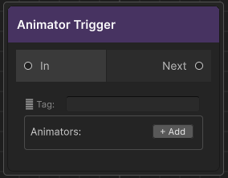{ width="260" }

Silently sets one or more Animator parameters on registered speakers and advances. No dialogue is shown.

Use this to trigger animations at precise moments in dialogue flow without tying them to an NPC speak node — for example, playing a gesture animation between two NPC lines, or triggering a walk cycle after a dialogue branch resolves.

### Fields

Each action card has:

| Field | Description |
|---|---|
| **Parameter Name** | Exact Animator parameter name (case-sensitive) |
| **Type** | Trigger / Bool / Int / Float |
| **Value** | Visible and editable for Bool, Int, Float. Hidden for Trigger. |
| **Speaker (override)** | Name of the registered speaker whose Animator to target. Blank = falls back through: graph's **Default Speaker** → current actor's speaker. |
| **✕** | Removes this action card |

The Animator is found via `GetComponentInChildren<Animator>()` called on the speaker's transform at `RegisterSpeaker` time (i.e. when the `NPCDialogue` component starts) and cached for the duration of the session. If no Animator is found at registration, a warning is logged and the action is skipped.

---

## Shared: Return Tag (⚐ Tag field)

Every node has a **⚐ Tag** field at the top. This is the node's **Return Tag** — a string identifier used exclusively as a Jump Node target.

- Leave blank if no Jump Node needs to target this node
- Tags must be unique within a graph (the validator will warn you about duplicates)
- Tags are resolved at runtime by string comparison — renaming a tag after a Jump Node references it will break the jump

The tag is displayed as a small badge on the node in the graph editor when set.

---

## Shared: Prevent Dialogue Exit

Every node also has a **Prevent Dialogue Exit** toggle (shown below the ⚐ Tag field). When enabled:

- `DialogueManager.CancelDialogue()` is a no-op while this node is active
- The built-in Escape-key handler in `DialogueUI` is ignored
- `DialogueManager.CanCancel` returns `false`

Use this to protect nodes that write variables, grant quest rewards, or play mandatory story beats that must not be interrupted. The validator will flag any locked node that has no reachable End node, since that would leave the player permanently stuck.
