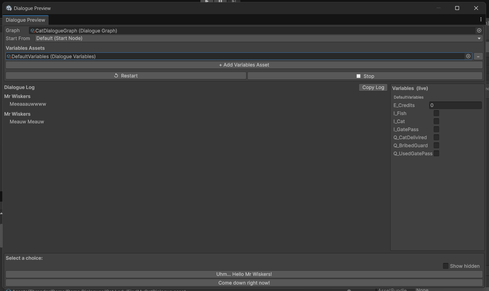

# Dialogue Preview Window

Open via **Threader → Dialogue Preview** (or `Ctrl+Shift+P`).

Runs a complete dialogue playthrough entirely inside the Editor — no Play mode required. Uses the same `DialogueRunner` as production, so the behaviour is identical to runtime.

---

## Fields

| Field | Description |
|---|---|
| **Graph** | Drag any `DialogueGraph` asset here |
| **Start From** | Choose the default start node or any named entry point |
| **Variables** | Drag one or more `DialogueVariables` assets here; values are seeded from defaults and shown live in the right panel |
| **Dialogue log** | Scrollable transcript — NPC lines, player choices, events (✏ Set, ↩ Jump, ✀ FireEvent, etc.), and system messages |
| **Show hidden** | Toggle to reveal choices that are hidden by failed conditions |
| **Copy Log** | Copies the full transcript to the clipboard |

---

## How it works

Variable values are seeded from the asset defaults when you click **Play** and reset when you click **Stop** — the on-disk ScriptableObject is **never** modified by the preview. This makes it safe to iterate without affecting your game state.

`{varName}` and `{varName:name}` tokens are resolved in the preview log, so what you see matches exactly what players see at runtime.

The preview runs fully in edit mode — no need to enter Play mode to test conversation flow, check conditions, or verify variable substitution.

{ width="520" }

---

## Workflow tips

- **Test entry points** — use the **Start From** dropdown to jump into any branch directly without having to play through the whole graph
- **Debug conditions** — enable **Show hidden** to confirm that failing conditions are correctly hiding/locking the right choices
- **Check variable tokens** — drag in your `DialogueVariables` asset and confirm `{varName}` substitution looks right before going into Play mode
- **Copy log for review** — use **Copy Log** to paste the full transcript into a document for writer review or QA notes
